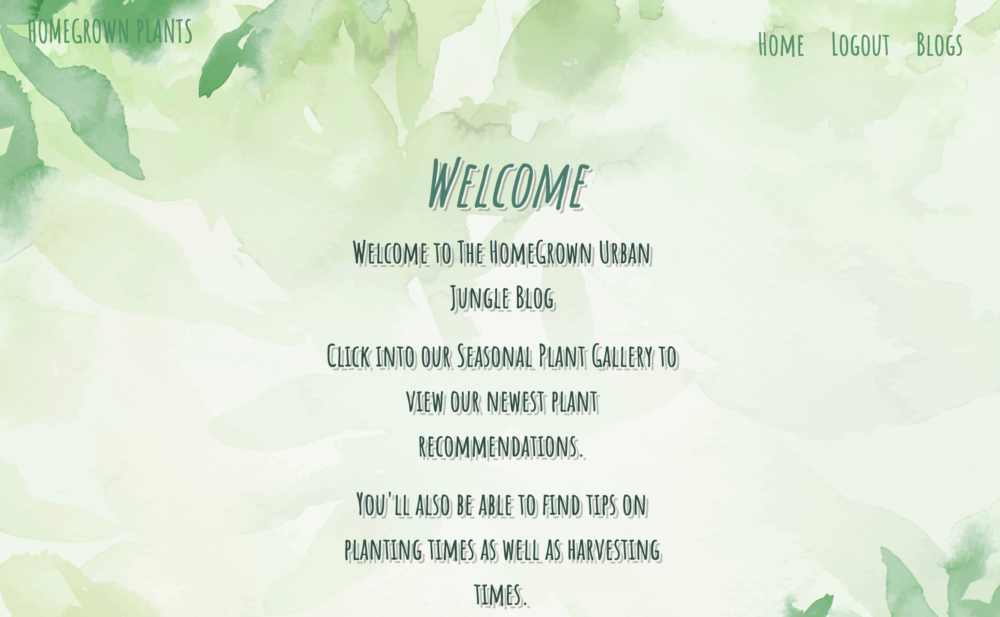
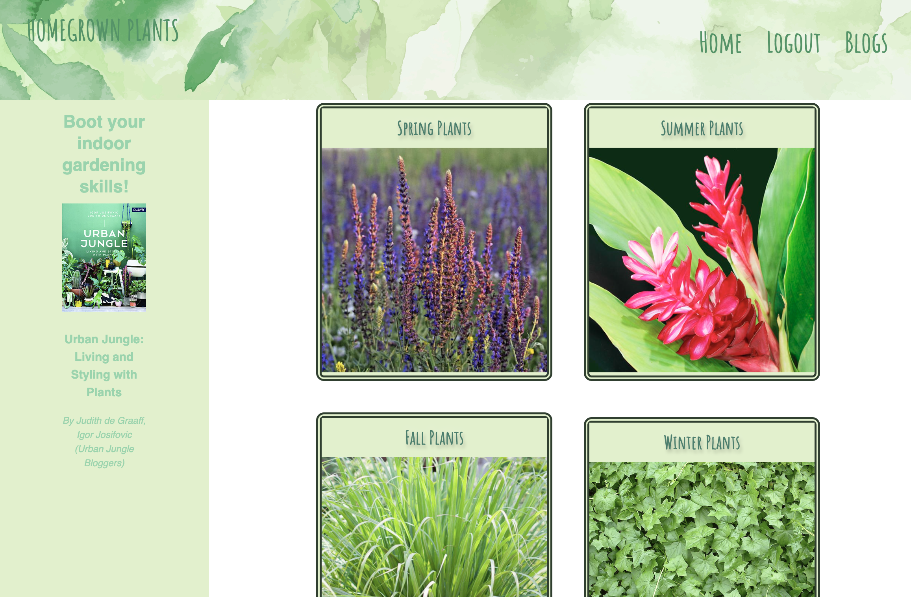
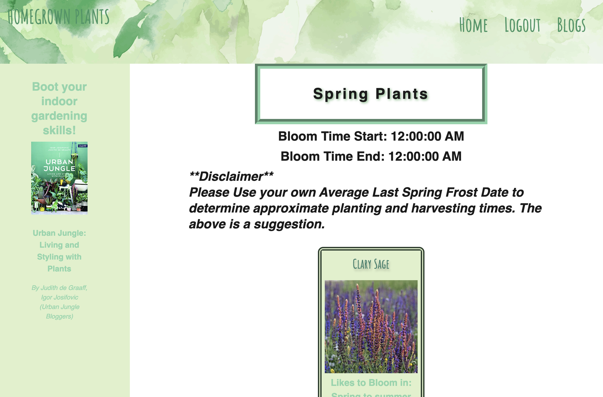
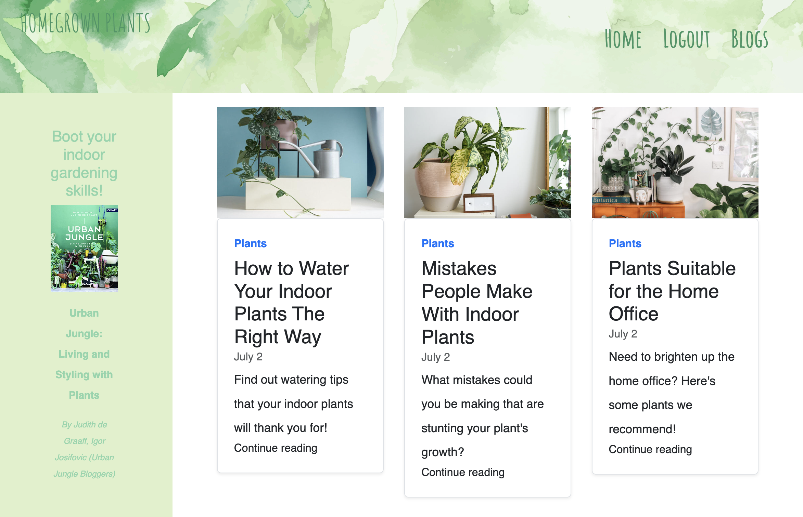

# Project_2


## Description 

## Table of Contents
* [Installation](#installation)
* [User Story](#user-story)
* [Acceptance Criteria](#acceptance-criteria)
* [Video](#video)
* [Screenshots](#screenshots)
* [Usage](#usage)
* [Testing](#testing)

## Installation 

1. Clone the repository from GitHub
1. Install `node.js`
1. Run `npm install` to install dependencies. Dependencies include mysql, console.table, express, inquirer, ........
1. Run `mysql -u root -p` to start the database connection. 
1. Updated `connection.js` file with your own mysql user password. 
1. Create the database by running the command: `source db/schema.sql`.
1. Seed the database by running the command: `source db/seeds.sql`.
1. Run `npm start` to start the web server and connect

 
## User Story

```md
AS A plant blogger
I WANT to be able to view seasonal plant tips, as well view blog posts about gardening tips
SO THAT I can organize and grow my gardening tips


```

## Acceptance Criteria

```md
Use Node.js and Express.js to create a RESTful API.

Use Handlebars.js as the templating engine.

Use MySQL and the Sequelize ORM for the database.

Have both GET and POST routes for retrieving and adding new data.

Be deployed using Heroku (with data).

Use at least one new library, package, or technology that we haven’t discussed.

Have a polished UI.

Be responsive.

Be interactive (i.e., accept and respond to user input).

Have a folder structure that meets the MVC paradigm.

Include authentication (express-session and cookies).

Protect API keys and sensitive information with environment variables.

Have a clean repository that meets quality coding standards (file structure, naming conventions, best practices for class/id naming conventions, indentation, quality comments, etc.).

Have a quality README (with unique name, description, technologies used, screenshot, and link to deployed application).
```


## Screenshots

<br>
<br>
<br>
<br>


## Usage
To build a gardening database, using Node.js, Inquirer, and MySQL.

